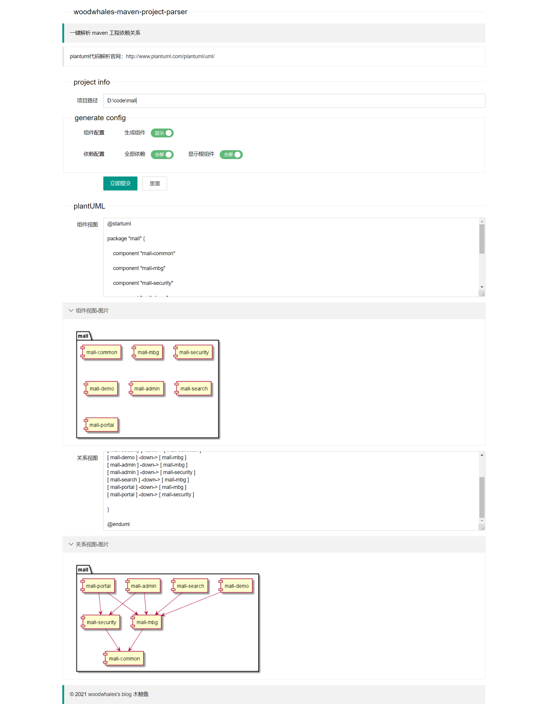

# woodwhales-maven-project-parser

[](https://woodwhales.cn/) 

> :rocket: 针对 https://github.com/woodwhales/woodwhales-PlantUML-Tools 工程进行了重构，代码组织更简洁，扩展性更强。

根据指定 maven 工程生成组件图及模块关系视图的 plantUML 代码。

说明：plantUML 语法学习及安装，请移步至笔者的博文：[PlantUML 语法之时序图](https://woodwhales.cn/2019/01/13/017/)

> JDK 运行环境要求：JDK 1.8+
>
> 默认访问URL：http://127.0.0.1:8086/maven-project-parser/
> 
> 初始化数据库脚本：[init.sql](doc/db/init.sql)
>
> 在线生成 plantUML 图片：https://cloudcoders.cn/plant-uml

指定好根项目的绝对路径，选择组件视图代码中是否需要生成组件代码（默认不开启），点击立即提交即可。



以 mall 项目为例：https://github.com/macrozheng/mall

生成效果如下：

组件视图


关系视图


vsCode 集成的 plantUML 有默认图片大小限制，因此可以使用官网（https://plantuml.com/zh/download）提供的 jar 文件生成图片，执行如下命令：

> 官网下载：[plantuml.jar](http://sourceforge.net/projects/plantuml/files/plantuml.jar/download)

```shell
java -DPLANTUML_LIMIT_SIZE=8192 -jar plantuml.jar -charset UTF-8 D:\index.puml
```

参数说明：

`-DPLANTUML_LIMIT_SIZE`参数是设置图像的宽高，需要设置对应的大小即可。如果图像很大会存在内存问题。需要将参数`-Xml1024m`添加到 Java 虚拟机。

笔者将 plantuml-server 源码下载编译，自己搭建了一个在线预览版：https://cloudcoders.cn/plant-uml