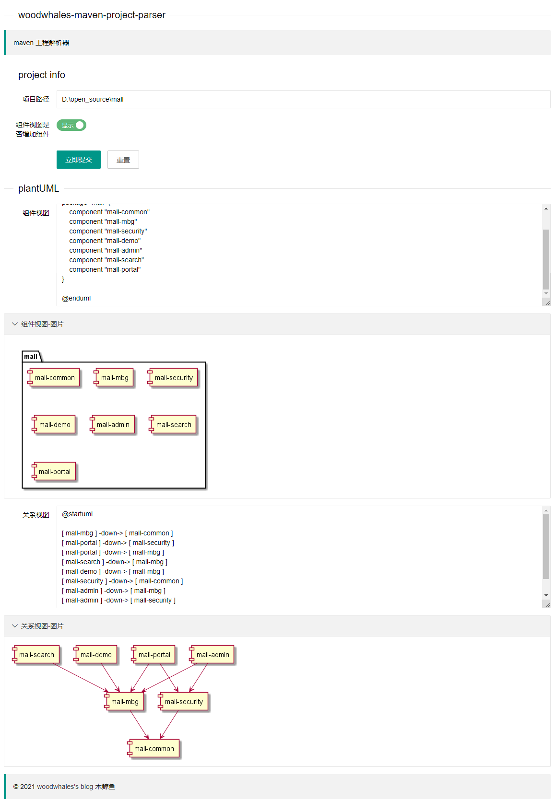
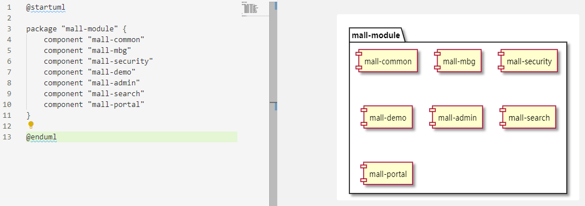
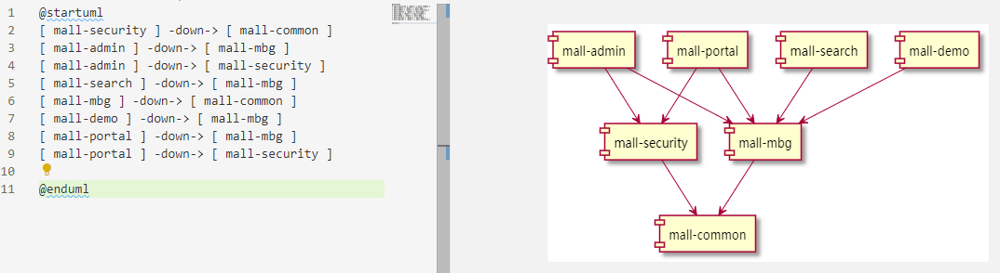

# woodwhales-maven-project-parser

 

> :rocket: 针对 https://github.com/woodwhales/woodwhales-PlantUML-Tools 工程进行了重构，代码组织更简洁，扩展性更强。

## 前言

**根据指定 maven 工程一键生成组件图及模块关系视图的 plantUML 代码及图片文件。**

说明：plantUML 语法学习及安装，请移步至笔者的博文：[PlantUML 语法之时序图](https://woodwhales.cn/2019/01/13/017/)

> JDK 运行环境要求：JDK 1.8+
>
> 默认访问URL：http://127.0.0.1:8086/maven-project-parser/
> 
> 初始化数据库脚本：[init.sql](doc/db/init.sql)
>
> 在线生成 plantUML 图片：https://cloudcoders.cn/plant-uml

## 使用指南

步骤 1：填写项目的绝对根路径

步骤 2：选择组件视图代码中是否需要生成组件代码（默认不开启）

步骤 3：点击`立即提交`按钮即可。

## 示例

以 mall 项目为例：https://github.com/macrozheng/mall

生成效果如下：

组件视图

关系视图

